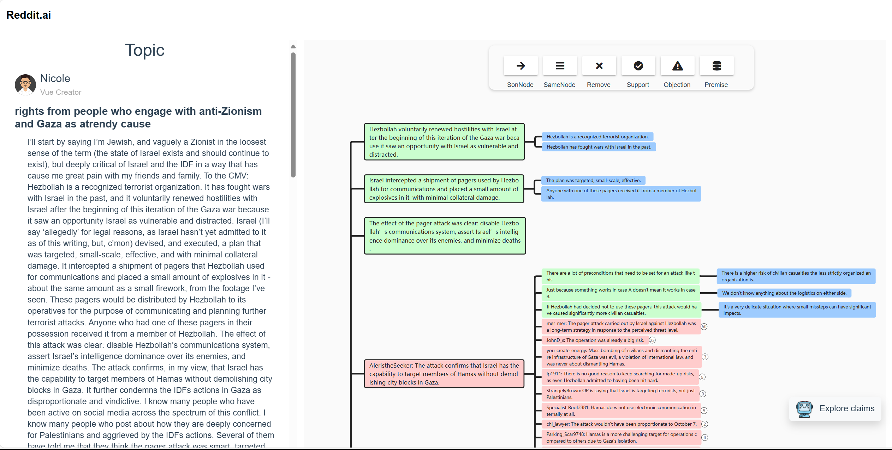
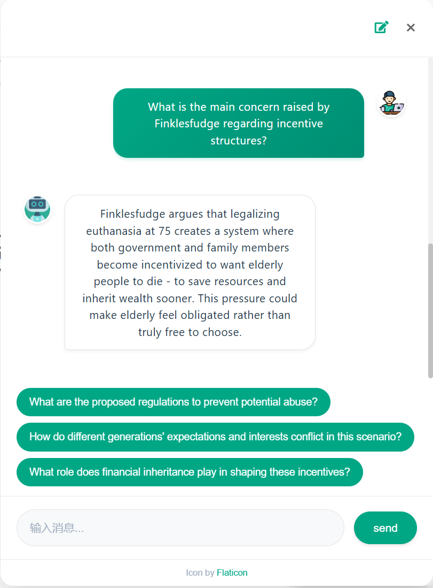

# Question-Driven Interactive Mind Map
一个基于Vue.js和Flask的辩论思维导图与智能对话系统，帮助用户更好地理解和探索辩论主题。

## 功能特点

- 📊 交互式思维导图展示辩论主题和观点
- 💬 智能对话系统，支持观点探索和批判性思维训练
- 🔄 实时更新的评论展示
- 📱 响应式设计
- 🎨 美观的UI界面设计

## 主要功能模块

### 思维导图

- 使用[simple-mind-map](https://github.com/wanglin2/mind-map/tree/main)实现思维导图
- 

### 对话系统
- **批判性思维练习**
- 支持多轮对话
- 预设问题列表
- 观点探索功能
- 

### 评论展示
- 实时更新的评论列表
- 支持评论正负观点高亮标识

## 技术栈

### 前端
- Vue 3
- Vuex
- Vue Router
- Axios
- Bootstrap
- Vuetify
- Simple-mind-map

### 后端
- Flask
- Flask-CORS
- OpenAI API

